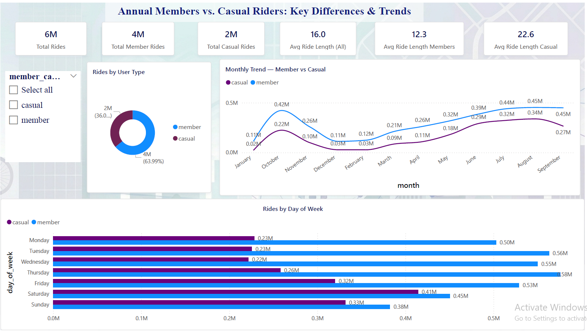
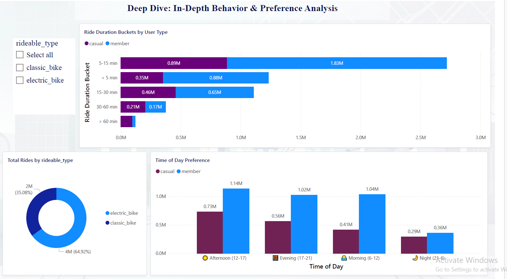

# 🚴 Cyclistic Bike-Share Analysis
### Google Data Analytics Capstone Project


---

## 📌 Project Overview

This is the capstone project for the **Google Data Analytics Professional Certificate**.  
The goal was to analyze 12 months of bike-share trip data to understand **how casual riders and annual members use Cyclistic bikes differently** — and provide data-driven recommendations to convert casual riders into members.

---

## ❓ Business Question

> *"How do annual members and casual riders use Cyclistic bikes differently?"*

---

## 📊 Dashboard Preview

### Page 1 — Ride Overview


### Page 2 — Ride Behavior & Patterns


---

## 🔍 Key Findings

| Insight | Members | Casual Riders |
|---|---|---|
| Total Rides | 4M (64%) | 2M (36%) |
| Avg Ride Length | 12.3 min | 22.6 min |
| Peak Days | Weekdays | Weekends |
| Peak Time | Morning & Evening | Afternoon |
| Most Common Duration | 5–15 min | 5–15 min |

### 📈 Main Insights:
- **Members** ride more frequently but for shorter durations → likely commuters
- **Casual riders** take longer trips mainly on weekends → likely leisure use
- Both groups prefer **electric bikes** (64.92% of total rides)
- Ridership peaks in **summer (July–August)** and drops in winter for both groups

---

## 💡 Recommendations

1. **Targeted weekend campaigns** — offer weekend membership trials to casual riders
2. **Seasonal promotions** — launch summer membership discounts (May–August)
3. **Afternoon deals** — casual riders peak 12–17h, ideal time for in-app promotions
4. **Electric bike perks** — highlight electric bike benefits in membership plans

---

## 🛠️ Tools Used

- **Power BI Desktop** — Dashboard & Visualizations
- **Power Query** — Data cleaning & transformation
- **DAX** — Calculated columns & measures
- **Excel / CSV** — Raw data source (12 months of trip data)

---

## 📁 Files

```
📁 cyclistic-bike-share-analysis/
├── 📁 screenshots/
│   ├── page1.png
│   └── page2.png
└── 📄 README.md
```

---

## 📚 Data Source

- **Source:** [Divvy Bike Trip Data](https://divvy-tripdata.s3.amazonaws.com/index.html)  
- **License:** [Divvy Data License Agreement](https://ride.divvybikes.com/data-license-agreement)  
- **Period:** 12 months of trip records  
- **Size:** ~6 million rows

---

*This project was completed as part of the Google Data Analytics Professional Certificate capstone.*
